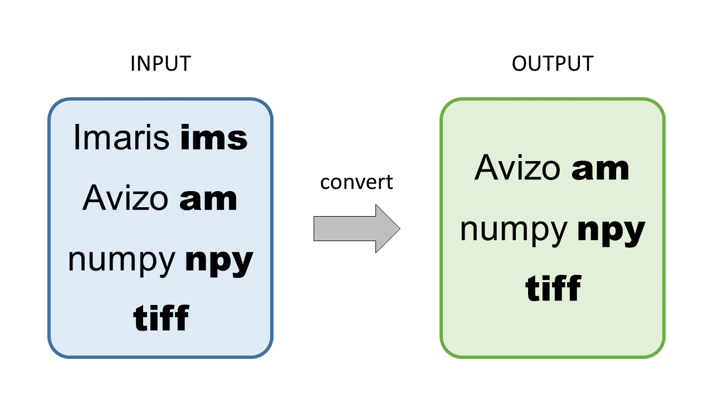

# BRCCIC
A easy python image conversion script which helps you convert 3D image files such as Avizo `*.am` files, numpy `*.npy` array files, Imaris `*.ims` files and `*.tiff` files to `*.am`, `*.npy` and `*.tiff` file formats. Bounding box information will also be kept during conversion excluding *.npy format.

BRCCIC stands for Brain Reseach Center[^1] Common Image Converter.



## How to use

Run BRCCIC.py in command line.
```
$ python BRCCIC.py <input file or folder> <output file format>
```
options:
| Short | Long | Default | Description |
| - | - | - | - |
| -o | --output | same folder as the script | File output destination |

## Note
- Bounding box information was not combined in tiff and npy array files. So the information will get lost if you output files in both format. On the other hand, while converting tiff and npy files to avizo am, due to the need of bounding box info in am files, we set the min value of box to zero and max value to (side length of array - 1).
- Function of outputing ims file is not provided because it requires IMARIS license.

[^1]: [Brain Research Center, National Tsing Hua University.](http://brc.life.nthu.edu.tw/)